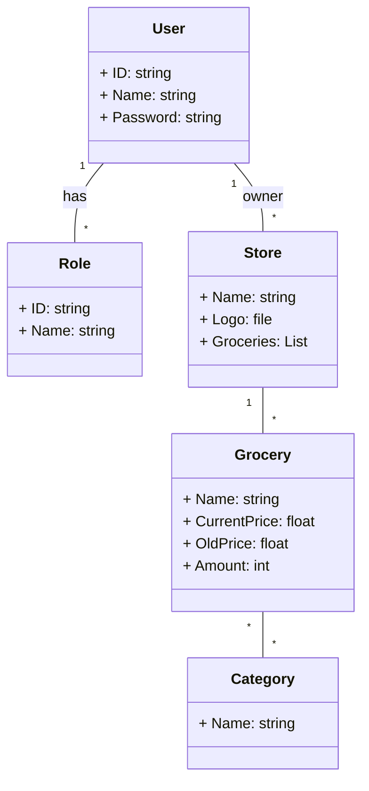

# TBM

Application for finding food sales in different local stores.

## Live Website

[](https://github.com/MartinWillu/TBM/actions/workflows/deploy-to-azure.yml)

Check out the hosted website on Vercel: [https://tbm-three.vercel.app/](https://tbm-three.vercel.app/)

The backend is hosted on Azure by using Container Instances.

## Tech Stack

[](https://github.com/MartinWillu/TBM/actions/workflows/publish-frontend-docker.yml)
[](https://github.com/MartinWillu/TBM/actions/workflows/test-frontend.yml)

- **Frontend:** Vite, React, TypeScript

[](https://github.com/MartinWillu/TBM/actions/workflows/publish-backend-docker.yml)
[](https://github.com/MartinWillu/TBM/actions/workflows/test-backend.yml)

- **Backend:** ASP.NET, Entity Framework, PostgreSQL

## Getting Started

### Installation

1. **Environment Setup**

   Copy the `.env.example` file to a `.env` file in the root directory.

   ```bash
   cp .env.example .env
   ```

2. **Run with Docker**

   Build and start the application using Docker Compose:

   ```bash
   docker compose up -d --build
   ```

   Alternatively, comment out the build step in the [docker-compose.yml](docker-compose.yml) and use the built images from GHCR instead.

### Model Structures

Class Diagram:


